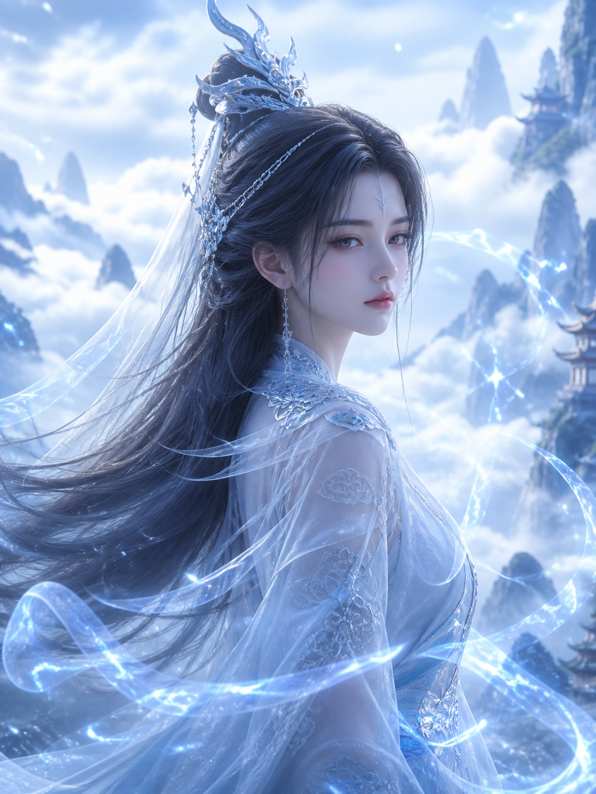
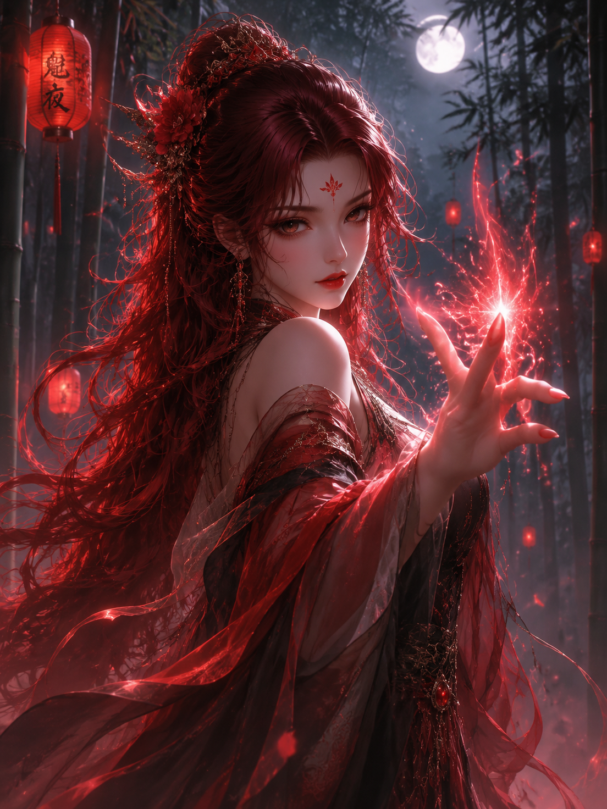

# 古风人像 / Guofeng Portrait Skill

[](https://opensource.org/licenses/MIT)
[](./CHANGELOG.md)
[](#-维度一画法)
[](#-维度二朝代形制)
[](#-美人风格图鉴与视觉画廊-beauty-gallery--styles)

> 🎨 古风**人像**提示词库与 Agent Skill —— 画法（3D 写实 / 水墨）× 朝代（唐 / 宋 / 魏晋）自由组合

---

## 📋 这是什么？

生成**古风人像**（角色立绘、头像、人物海报）的提示词库。

**只做人物。** 不做场景概念图、器物法宝、花鸟山水——人物所处的环境只作为
背景服务于人像。要那些题材请另找 skill，混在一起会让提示词失焦。

两个**正交维度**自由组合：**画法**（怎么画）× **朝代**（画哪个年代的形制）。
"宋韵美人的水墨画法" = `--style ink-wash` + `dynasties/song/`。

## 🌟 维度一：画法

### `3d-realistic` —— 国漫 3D 写实

对标《斗罗大陆》《斗破苍穹》《灵笼》《完美世界》《一念永恒》《凡人修仙传》。

不是日漫 2D，不是好莱坞 3D，是**国漫特有的东方审美 + 写实渲染 + 仙侠光效**：
UE5 Nanite/Lumen 级渲染、皮肤毛孔与发丝可见、体积光与灵气粒子、电影级景深。

题材：`character-male` / `character-female`

### `ink-wash` —— 国风水墨写意

对标《大鱼海棠》《中国奇谭》《天书奇谭》《山水情》。

手绘笔触（飞白、湿墨晕染）、宣纸质感、**极致留白**——留白是构图的一部分，
不是没画完。写意而非写实。

题材：`character`

### 📜 维度二：朝代形制

不指定朝代时，模型画的"汉服"多半是杂糅形制——各朝代的衣领、袖型、腰线混在一起，
懂的人一眼看出不对。指定朝代能拿到具体的服饰 token 与配色：

| 朝代 | 审美核心 | 适合 |
|---|---|---|
| **唐 `tang`** | 华贵丰腴、色彩浓烈 | 宫廷仕女、盛世气象 |
| **宋 `song`** | "淡到极致才是宋韵"，清雅低饱和 | 江南园林、庭院、肖像特写（资料最全） |
| **魏晋 `wei-jin`** | 飘逸出尘、褒衣博带 | 名士、洛神、松下抚琴 |

跨朝代通用的 4 段式骨架（主体 + 场景 + 光影 + 质感）在
`dynasties/common-prompt-base.md`，三个朝代只在服饰 / 色彩 / 气质上分支。
每个朝代还带一个 `scripts/generate.py`，直接调 museav 出图。

```bash
./dynasties/song/scripts/generate.py --dynasty song \
  --subject "春日庭院，少女倚栏观花，海棠初开" --ratio 3:4
```

> ⚠️ **两套画法的提示词互不相通**。3D 那套讲渲染与材质，水墨这套讲笔触与留白，
> 混用会让画面既不像 3D 也不像水墨。所以两边各自保留完整的
> references / examples / assets / build_prompt.py，顶层脚本只做路由。

---

## 🌸 美人风格图鉴与视觉画廊 (Beauty Gallery & Styles)

针对不同题材与审美品味，本 Skill 将古风与东方美人沉淀为完整的正交风格谱系与 CLI 图片模板。所有模板均已接入中台 `museav` CLI，支持一条命令开箱出图。

### 📊 美人风格与图片模板矩阵速查

| 模板 / 风格分类 | CLI 模板 Slug | 审美气质与核心质感 | 典型视觉特征 | 样图比例 | CLI 一键出图命令 |
|---|---|---|---|---|---|
| **🍵 古风书房品茶** | `ancient-tea-room` | 高级东方电影感、护肤品级水润肌 | 奶白交领宽袖、墨香卷轴、暖金单侧逆光、85mm 浅景深 | 3:4 | `museav gen --template ef125107-a2e8-41a5-a048-89a5ac4fe974` |
| **⚔️ 东方武侠电影感** | `wuxia-cinematic` | 古龙式危险美感、东方强骨相 | 日落侧逆光、风吹碎发、冷峻神情、局部阴影与书法标题留白 | 3:4 | `museav gen --template 6a5789d2-87e0-47d1-842c-90cf096dd866` |
| **📜 女性角色设定4视图** | `character-sheet-4view` | 人物一致性定妆、多视角立绘 | 正面、侧面、背面、特写 4 视图联动，统一发型服饰与五官 | 16:9 | `museav gen --template <id> --image <垫图>` |
| **🏛️ 历史古风题材** | `history-classic-art` | 历史考究、文化厚重 | 唐宋明清形制可选、工笔/写意/写实自由切换 | 3:4 | `museav gen --template 6ad907c2-66bd-453b-9b10-0b3157b7cad0` |
| **💄 女性人像20路线** | `female-portrait-routes` | 水光妆/冷感仙侠/新中式/盛唐丰腴 | 20 条专业人像路线，精准控制妆造与骨相 | 3:4 | `museav gen --template d5dac3dc-31de-4ea9-a81b-fa044ccec677` |
| **🕊️ 国漫清冷仙子** | `3d-realistic` 仙侠 | 绝尘出世、清冷出尘 | 冰蓝仙裙、星辰眼神、发丝轮廓光、云海仙山 | 3:4 | `python scripts/build_prompt.py --style 3d-realistic ...` |
| **🥀 国漫妩媚妖女** | `3d-realistic` 玄幻 | 妖娆魅惑、神秘危险 | 红黑轻纱、眉间花钿、指尖灵力微芒、月下灯笼 | 3:4 | `python scripts/build_prompt.py --style 3d-realistic ...` |
| **🖌️ 国风写意仕女** | `ink-wash` 水墨 | 诗意禅境、空灵留白 | 宣纸肌理、墨分五色、飞白笔触、朱砂微点 | 3:4 | `python scripts/build_prompt.py --style ink-wash ...` |
| **🪟 窗光高级生活照** | `window-light-lifestyle` | 真实摄影感、去 AI 塑料味标杆 | Sony 85mm f/1.4、暖窗侧光、呼吸感真实毛孔与发丝 | 3:4 | `museav gen --template f17c7142-ce60-46b1-805f-da0a6d96e612` |
| **🌅 黄金时刻自拍** | `golden-hour-car-selfie` | 手机原生质感、真实东方鹅蛋脸 | 夕阳斜射、不完美裁切、无过度磨皮纯生图质感 | 3:4 | `museav gen --template 44dd583a-8a7b-4f44-8b2c-959900a2ea4b` |

---

### 🎨 经典美人模板视觉画廊与出图指南

#### 1. 古风书房品茶 · 东方静谧美人 (`ancient-tea-room`)
> **核心美学**：高级东方电影截图 × 护肤品广告级肌肤质感 × 暖金侧逆光。彻底告别假面与网红脸。

<div align="center">
  
</div>

- **视觉配方**：
  - **人像特质**：年轻东方女性，鹅蛋脸骨相清晰自然，温润象牙白肤质，保留微细肌理与自然血色。
  - **服饰场景**：奶白古装交领长裙（纱质宽袖带暗纹）；置身深色木质书架、卷轴笔架与古朴茶室。
  - **光影镜头**：单一自然侧逆光，金色夕阳穿透衣料形成柔和光晕；85mm f/1.4 人像浅景深。
- **CLI 出图**：
  ```bash
  museav gen --template ef125107-a2e8-41a5-a048-89a5ac4fe974
  ```

---

#### 2. 东方武侠电影感 · 危险与宿命感美人 (`wuxia-cinematic`)
> **核心美学**：古龙式静止危险美学 × 新东方电影感摄影 × 强烈情绪留白。拒绝古偶廉价感与仙侠塑料发光。

<div align="center">
  
</div>

- **视觉配方**：
  - **人像特质**：成熟从容东方骨相，眼神清冷克制带有一丝未解的危险；风吹散落碎发，自然冷红肤色。
  - **故事张力**：暗沉重袍披风带霜雪，单一自然夕阳/月色侧逆光，面部局部处于阴影之中。
  - **留白排版**：上方留出充足负空间，可自然融入中式书法标题；带细微胶片颗粒。
- **CLI 出图**：
  ```bash
  museav gen --template 6a5789d2-87e0-47d1-842c-90cf096dd866
  ```

---

#### 3. 女性角色设定 4 视图 · 人物一致性定妆 (`character-sheet-4view`)
> **核心美学**：多角度立绘资产级输出。用于解决长篇短剧、连载插画、漫剧生产中的“人物容易跑脸”痛点。

<div align="center">
  <table>
    <tr>
      <td align="center"><b>正面全身立绘</b><br/></td>
      <td align="center"><b>侧身动态神韵</b><br/></td>
    </tr>
    <tr>
      <td align="center"><b>背面与服饰结构</b><br/></td>
      <td align="center"><b>五官与神态特写</b><br/></td>
    </tr>
  </table>
</div>

- **核心价值**：同一角色锁定发髻、衣领、腰封、刺绣纹样与五官骨相，一套 4 张多角度拆解，作为后续出图的垫图母版（Reference Anchor）。

---

#### 4. 历史古风题材全景 (`history-classic-art`)
> **核心美学**：朝代形制考究、文化纹样严谨。支持唐、宋、明、武侠江湖自由切换。

<div align="center">
  
</div>

- **CLI 出图（支持字段替换）**：
  ```bash
  # 宋代文秀美人
  museav gen --template 6ad907c2-66bd-453b-9b10-0b3157b7cad0 \
    --fields '{"era":"宋朝庭院","subject":"素衣仕女倚栏品茶观海棠","style":"影视写实"}'
  ```

---

#### 5. 女性肖像路线 20 系列 (`female-portrait-routes`)
> **核心美学**：专攻东方女性人像摄影，包含 20 条互斥路线，禁止风格混搭污染。

<div align="center">
  
</div>

- **典型细分路线**：
  - `ancient-lady-dewy-makeup`：古风仕女水光妆，通透骨相与水润肌肤。
  - `bright-luxury-gufeng`：明艳华丽盛唐古风，高髻步摇、明艳妆造。
  - `cold-xianxia-enhanced`：冷感仙侠神女，绝尘清冷。
  - `oriental-voluptuous`：东方丰腴古典体态，温婉大气。
  - `new-chinese`：新中式现代国潮人像。

---

#### 6. 国漫 3D 写实 · 仙侠双姝（清冷仙子 vs 妩媚妖女）
> **核心美学**：对标顶级国漫番剧写实渲染。UE5 Nanite + Lumen 全局光照，发丝根根分明，仙侠灵气粒子。

<div align="center">
  <table>
    <tr>
      <td align="center"><b>清冷仙子 (Immortal Fairy)</b><br/></td>
      <td align="center"><b>妩媚妖女 (Enchantress)</b><br/></td>
    </tr>
  </table>
</div>

- **仙子核心特征**：淡蓝云纹仙裙、发丝蓝色侧逆光轮廓、清冷疏离、眼含星辰、背景虚化云海仙山。
- **妖女核心特征**：红黑轻纱微透、额前朱砂花钿、指尖灵力微芒、月下红灯笼、暗调暖光。

---

#### 7. 国风传统水墨 · 写意仕女 (`ink-wash`)
> **核心美学**：手绘宣纸肌理、墨分五色（焦浓重淡清）、逆锋飞白、大面积留白与朱砂唇色点睛。

<div align="center">
  
</div>

- **核心特征**：写意而不写实，手绘毛笔触感可见，纸张纤维底色，留白装得下中式意境。

---

#### 8. 东方美人的现代去 AI 味标杆模板 (`window-light` & `golden-hour`)
> **核心美学**：通过真实窗光与自然日光，解决 AI 生成“塑料假面、过度磨皮”的核心难题。

<div align="center">
  <table>
    <tr>
      <td align="center"><b>窗光高级生活照 (85mm 实拍感)</b><br/></td>
      <td align="center"><b>黄金时刻自拍 (无修原生感)</b><br/></td>
    </tr>
  </table>
</div>

- **去 AI 味实战增强句（推荐附加）**：
  ```
  The portrait should immediately feel believable at first glance.
  Preserve tiny imperfections, natural asymmetry, realistic skin texture,
  subtle hair flyaways, authentic lighting, and a strong sense of human presence.
  ```

---

### 💡 出图避坑与模型调用法则

1. **绝对排雷清单**：
   - 严禁加入 `"8k", "masterpiece", "doll face", "unreal engine render"` 等被模型玩坏的空洞词，会直接触发千篇一律的 AI 网红假脸。
   - 必须强制排查：添加 `Avoid: modern elements, western makeup, plastic skin, distorted fingers, excessive smoothing`。
2. **多模型适配建议**：
   - **Seedream（火山引擎）**：东方美人脸型骨相最纯正，中文提示词理解最深。
   - **gpt-image-2**：**光影质感与皮肤微毛孔细节之王**。英文 Prompt + `cinematic lighting, 85mm f/1.4, subtle film grain` 效果封神。
   - **qwen-image**：批量摸索与快速出多版人物草稿首选。

---

## 🚀 三种用法

### 一、装成 Agent Skill（推荐）

把整个仓库放进 agent 的 skills 目录，`SKILL.md` 就是入口，
agent 会自己问清风格与题材再出图。

### 二、命令行生成提示词

```bash
# 国漫 3D 写实 · 男性角色 · 人像画幅
python scripts/build_prompt.py --style 3d-realistic \
  --subject "冷峻的青年剑修，月下山巅，黑色长发高束" \
  --category character-male --ratio 3:4

# 国风水墨 · 人物
python scripts/build_prompt.py --style ink-wash \
  --subject "白衣书生，竹林独坐" \
  --category character --ratio 3:4
```

输出 JSON，含 `positive_zh` / `positive_en` / `negative_*` / `recommended_size`。
不带 `--style` 默认 `3d-realistic`。

### 三、直接抄示例

- `styles/3d-realistic/examples/character-male|character-female/` — 英文提示词
- `styles/3d-realistic/examples-zh/characters/` — 中文提示词，更细
- `styles/3d-realistic/prompt-library-zh.md` — 中文人像提示词库全文（关键词表、镜头参数、组合公式、避坑）
- `styles/ink-wash/examples/character/` — 水墨人物示例

每个示例带完整提示词（中英）、参考图、推荐画幅。

---

## 📁 目录结构

```
SKILL.md                    Agent 入口（风格路由 + 工作流）
manifest.yaml               与 SKILL.md frontmatter 同步
scripts/build_prompt.py     薄分发器，按 --style 转给对应风格
dynasties/
  common-prompt-base.md     跨朝代 4 段式通用骨架
  tang/ song/ wei-jin/      各朝代的 SKILL.md + references/ + scripts/generate.py
styles/
  3d-realistic/
    build_prompt.py         该风格完整的提示词构建器
    prompt-library-zh.md    中文提示词库全文
    references/             visual-dna / camera-lenses / negative-prompts / model-recommendations
    examples/  examples-zh/ 人像示例提示词（英 / 中）
    assets/                 人像参考图
  ink-wash/
    build_prompt.py
    references/             visual-dna / brush-techniques / negative-prompts / model-recommendations
    examples/  assets/
    SKILL-original.md       合并前的独立版本，保留备查
```

---

## 📜 由三个仓库合并而来

v2.0.0 之前这是三个独立仓库，主题互相重叠：

| 原仓库 | 内容 | 去处 |
|---|---|---|
| `donghua-3d-skill` | 国漫 3D 写实 skill（英文，结构完整） | 本仓库（保留 git 历史） |
| `guoman-3d-skill` | 同主题的中文提示词库版本 | `styles/3d-realistic/prompt-library-zh.md` + `examples-zh/` |
| `guoman-ink-wash-skill` | 国风水墨 skill | `styles/ink-wash/` |
| `guofeng-meiren` | 古风美人 skill 集（唐/宋/魏晋朝代形制） | `dynasties/` |

前两个是**同一主题的两个版本**（slug 都是 `*-3d-realistic`），一个是 skill 包格式、
一个是提示词库格式，各自演进互不知情——正是"一个项目两个仓库"的典型。

v2.1.0 进一步收窄为**纯人像**：场景、器物、自然、诗意题材的素材与提示词全部移除，
两份 `build_prompt.py` 的对应 category 一并删掉。定位模糊的工具没人用得顺手。

v3.0.0 并入 `guofeng-meiren`——它同样是古风人像出图 skill，只是切分维度不同
（按朝代而非按画法）。两者正交互补：原来只说"形制统一的汉服"却没有朝代知识，
现在补上了唐/宋/魏晋的具体服饰 token 与配色。

## 📄 License

MIT
