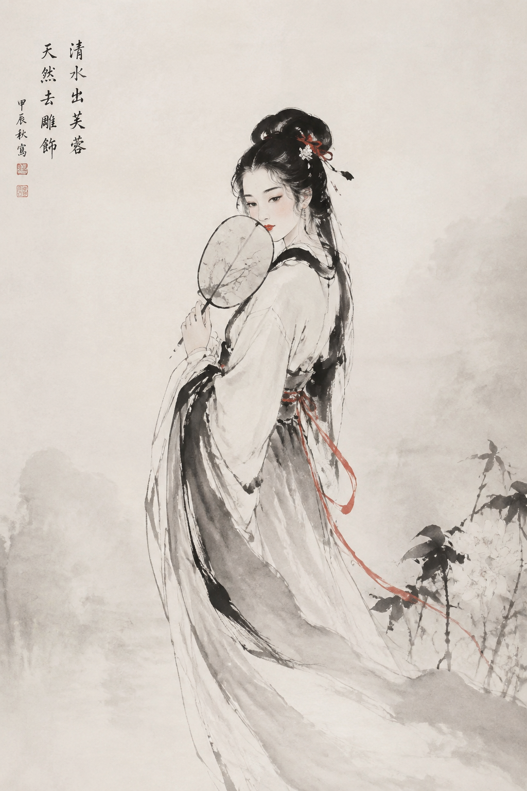
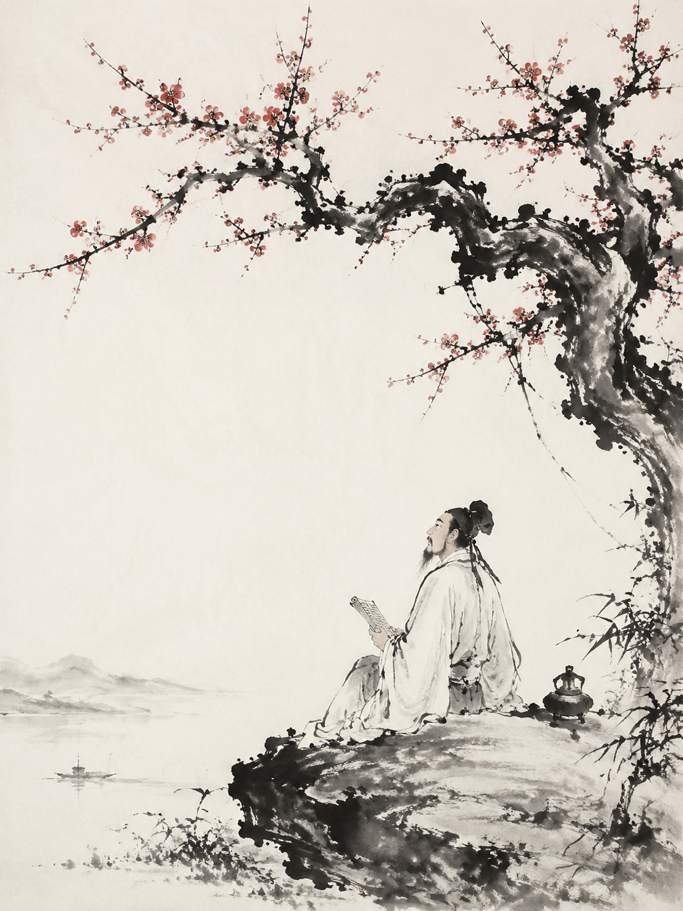

# 古风人像 / Guofeng Portrait Skill

[](https://opensource.org/licenses/MIT)
[](./CHANGELOG.md)
[](#-画法一览)
[](#-朝代形制)
[](#-作品--works)

> 🎨 古风**人像** Agent Skill —— **先教审美判断，再给落地参数**。
> 画法（3D 写实 / 水墨 / 氛围胶片）× 朝代（唐 / 宋 / 魏晋）自由组合。

**这个 README 的主角是作品，不是代码。** 架构、槽位、脚本全部折叠在文末。

---

## 🖼 作品 / Works

### 🎞 胶片氛围 · `film-ambient`

> 真实摄影，不是渲染。低饱和青绿月白、侧逆光斑驳树影、胶片颗粒、清冷易碎的情绪。

<p align="center">
  <a href="styles/film-ambient/references/style-presets.md">
    
  </a>
  <br/>
  <sub><b>风格总览 · 九宫格</b> —— 花影柔光 · 雪落庭院 · 竹影清茶 · 灯下夜读 · 绿意回眸 · 湖畔逆光 · 江湖冷调 · 落英慵卧 · 提灯夜行</sub><br/>
  <sub>九种气质，同一套提示词体系 · 对应 <a href="styles/film-ambient/references/style-presets.md">21 个命名风格</a> 中的前 9 个</sub>
</p>

<table>
  <tr>
    <td width="50%" align="center">
      
      <br/><b>春日庭院 · 倚栏观花</b>
      <br/><sub>宋韵 · 暖雾侧逆光 · 荷塘前景 · 85mm 浅景深</sub>
    </td>
    <td width="50%" align="center">
      
      <br/><b>湖畔暮色 · 柳影落日</b>
      <br/><sub>宋韵 · 逆光轮廓 · 亭台剪影 · 荷花</sub>
    </td>
  </tr>
</table>

<p align="center">
  <sub>↑ 两张都是本 skill 的 <code>dynasties/song/</code> + 胶片氛围画法的实际产出：<br/>
  「淡到极致才是宋韵」—— 低饱和、有光源、有前景遮挡、留白给空气。</sub>
</p>

**命名风格示例** —— 同一张脸垫图锁定，三个 `--preset` 各出一张（柔光 / 青绿 / 夜景）：

<table>
  <tr>
    <td width="33%" align="center">
      
      <br/><b>🌸 花影柔光</b><br/><sub><code>blossom-veil</code></sub>
      <br/><sub>斑驳树影 · 花枝三层前景 · 抓拍特写 85mm</sub>
    </td>
    <td width="33%" align="center">
      
      <br/><b>🎋 竹影清茶</b><br/><sub><code>bamboo-tea</code></sub>
      <br/><sub>竹叶漏光 · 青绿通透 Pro 400H · 倚栏</sub>
    </td>
    <td width="33%" align="center">
      
      <br/><b>🏮 提灯夜行</b><br/><sub><code>lantern-walk</code></sub>
      <br/><sub>灯笼暖光 · CineStill 800T 夜景 · 回眸</sub>
    </td>
  </tr>
</table>

---

### 🕊 国漫 3D 写实 · `3d-realistic`

> **70% 真人质感 + 30% 国漫理想化** —— 美型但保留真人骨相。
> 20 岁左右**成年少女骨相**（不是幼童、不是御姐）：精致小鹅蛋脸、面中饱满、下颌线流畅、
> 下巴短小圆润；大而清澈的暖棕**杏眼**，虹膜有真实晶体层次与细密纹理；
> 皮肤白皙通透但有真实血色、柔和次表面散射与微毛孔，**不磨皮、不塑料、不蜡像**；
> 发饰小巧精致、**克制不堆砌**。

<p align="center">
  
  <br/>
  <sub><b>国漫女主特写</b> · <code>heroine-closeup</code> —— 本画法基准样张</sub><br/>
  <sub>超近头肩肖像（脸占 70-80%）· 暖金侧逆光 + 灯笼光斑 · 白玉花饰 + 珍珠流苏</sub>
</p>

<table>
  <tr>
    <td width="33%" align="center">
      
      <br/><b>🏛 亭台托腮</b><br/><sub>书案 · 青瓷茶盏 · 竹帘 · 荷塘远景 · 自然侧光</sub>
    </td>
    <td width="33%" align="center">
      
      <br/><b>🌸 庭前持花</b><br/><sub>玉花 + 珍珠流苏 · 花枝前景 · 斑驳树影</sub>
    </td>
    <td width="33%" align="center">
      
      <br/><b>📜 执卷回眸</b><br/><sub>青绿纱衣 · 竹卷轴 · 光影层次 · 回眸</sub>
    </td>
  </tr>
</table>

<p align="center">
  <sub>↑ 这几张就是 <code>3d-realistic</code> 的验收标准：<b>骨相是成年人的，皮肤是有人味的，光是有出处的，</b>
  <br/>发饰只有一件 —— 而不是满头珠翠 + 满屏荧光 + 塑料磨皮。</sub>
</p>

---

### 🖌 国风水墨 · `ink-wash`

> 对标《大鱼海棠》《中国奇谭》《山水情》。手绘笔触、宣纸质感、**极致留白**——留白是构图的一部分，不是没画完。

<table>
  <tr>
    <td width="50%" align="center">
      
      <br/><b>🖌 国风写意仕女</b>
      <br/><sub>宣纸肌理 · 墨分五色 · 飞白笔触 · 朱砂微点</sub>
    </td>
    <td width="50%" align="center">
      
      <br/><b>📜 白衣书生</b>
      <br/><sub>竹林独坐 · 大面积留白 · 写意而非写实</sub>
    </td>
  </tr>
</table>

---

### 🚀 想要最好的出图体验

上面所有作品都出自 **MUSE AV** —— 我自己的 AI 出图中台。
不用自己搭环境、不用管 key，这个 skill 的 CLI 与 MCP 都直连它。

<p align="center">
  <a href="https://museav.top"></a>
  &nbsp;
  <a href="https://docs.museav.top"></a>
</p>

**同一个提示词，模型选错就白费。** 按用途选：

| 你想干什么 | 用哪个模型 | 为什么 |
|---|---|---|
| **人像定稿**（皮肤质感、光影层次） | **GPT Image 2.5** | 皮肤微纹理与光影质感最强 —— 本 skill 首选，**用英文 prompt** |
| **批量摸槽位组合** | qwen-image | 中文理解好、出图快，一次看多版构图 |
| **东方骨相、脸型最纯正** | Seedream | 东方美人脸型骨相最准，中文 prompt 理解最深 |
| **夜景 / 氛围片** | GPT Image 2.5 + `--film cinestill800t` | 钨丝灯胶片的 halation 只有它出得来 |

> **分工**：本 skill 负责"想清楚要什么"（[`AESTHETIC.md`](./AESTHETIC.md)）和"怎么落地"（槽位 / 预设），
> **MUSE AV 负责"把它画出来"。**

配套工具：[`museav-cli`](https://github.com/webkubor/museav-cli)（命令行出图）·
[`museav-mcp`](https://github.com/webkubor/museav-mcp)（接进 agent）

---

## ⚡ 三行上手

```bash
# ① 装成 Agent Skill：把仓库放进 agent 的 skills 目录，SKILL.md 即入口

# ② 点一个命名风格出图（21 个，--list 可查）
./styles/film-ambient/scripts/generate.py \
  --preset blossom-veil --subject "凑近花枝，微微侧脸" --ref ~/refs/face-anchor.jpg

# ③ 只出提示词，自己拿去别的模型
python scripts/build_prompt.py --style film-ambient --preset bamboo-tea --subject "…"
```

---

## 🧠 这一个 skill 和「提示词库」的区别

**提示词是答案，判断力是解题方法。答案会过时（模型换代、术语失效），方法不会。**

所以仓库的核心不是提示词表，而是 [`AESTHETIC.md`](./AESTHETIC.md) —— 一层跨画法通用的审美判断：

| 它在教什么 | 内容 |
|---|---|
| **六条第一性原理** | ① 克制法则（超过 3 个注意力锚点就是在堆砌）② 暗示优于直给 ③ **光必须有出处**（说不出光从哪来 = 假光）④ 情绪浓度 > 造型精度 ⑤ 真实感来自不完美（指不出 2-3 处瑕疵就是 CG）⑥ 对比度预算是有限的 |
| **推导链** | 情绪 → 光 → 色 → 构图 → 质感 → 镜头。**后一步是前一步的函数**，不是独立选项 |
| **诊断回路** | 出图不理想时：定位失败维度 → 只改那一维 → 重出。**不抽卡** |
| **反例解剖** | 「影楼汉服写真」为什么一眼俗 —— 七条逐项归因（反着做就是美） |
| **生成前 5 问** | 情绪是什么 / 光从哪来 / 删掉了什么 / 哪处不完美 / 记忆点是什么 |

> 生成前先答完 5 问。**答不出任何一条，就不要开始生成** —— 那说明你在复制，不是在创作。

📖 全文：**[`AESTHETIC.md`](./AESTHETIC.md)**

---

<details>
<summary><b>📐 全部架构与参数</b> &nbsp;·&nbsp; <sub>画法 / 朝代 / 槽位 / 预设 / 模型法则 / 目录结构 / 合并史 —— 点开</sub></summary>

<br/>

### 画法一览

#### `3d-realistic` —— 国漫 3D 写实
**70% 真人质感 + 30% 国漫理想化**，美型但保留真人骨相 —— 成年少女骨相、SSS 皮肤与微毛孔、
发饰克制不堆砌。四槽位（`--scene` / `--light` / `--framing` / `--mood`）+ 6 个命名风格。
不是日漫 2D，不是好莱坞 3D，**也不是满头珠翠 + 满屏荧光的廉价仙侠**（那是 v3.5.0 之前的病灶）。
题材：`character-female` / `character-male`

#### `ink-wash` —— 国风水墨写意
对标《大鱼海棠》《中国奇谭》《天书奇谭》《山水情》。
手绘笔触（飞白、湿墨晕染）、宣纸质感、极致留白。题材：`character`

#### `film-ambient` —— 古风氛围胶片人像
**真实摄影，不是渲染。** 用电影的摄影语言拍古装少女：低饱和青绿月白、
侧逆光斑驳树影、胶片颗粒、清冷易碎的情绪。**六槽位 + 21 个命名风格。**

> ⚠️ **三套画法的提示词互不相通**。3D 讲渲染与材质，水墨讲笔触与留白，
> film-ambient 讲摄影语言与胶片质感。混用会让画面同时不像 3D、不像水墨、也不像照片。

---

### 朝代形制

不指定朝代时，模型画的"汉服"多半是杂糅形制——各朝代的衣领、袖型、腰线混在一起，
懂的人一眼看出不对。指定朝代能拿到具体的服饰 token 与配色：

| 朝代 | 审美核心 | 适合 |
|---|---|---|
| **唐 `tang`** | 华贵丰腴、色彩浓烈 | 宫廷仕女、盛世气象 |
| **宋 `song`** | "淡到极致才是宋韵"，清雅低饱和 | 江南园林、庭院、肖像特写（资料最全） |
| **魏晋 `wei-jin`** | 飘逸出尘、褒衣博带 | 名士、洛神、松下抚琴 |

```bash
./dynasties/song/scripts/generate.py --dynasty song \
  --subject "春日庭院，少女倚栏观花，海棠初开" --ratio 3:4
```

---

### `film-ambient` 的六槽位

固定风格层永不变，只换槽位 —— **变的东西越少，出图越像同一个人拍的**。

| 槽位 | 取值 |
|---|---|
| `--scene` 环境 16 | `bamboo-garden` `snow-court` `lakeside-dusk` `study-lamp` `blossom-shadow` `night-lantern` `pine-terrace` `river-wind` `corridor-rain` `lotus-pond` `moonlit-court` `mountain-peak` `snow-field` `autumn-court` `boat-river` `pine-mist` |
| `--light` 光型 12 | `dappled-sun` `snow-diffuse` `bamboo-leak` `lamp-warm` `dusk-backlight` `lantern-night` `cold-window` `rain-soft` `moonlight` `mist-dawn` `candle-flutter` `overcast-silver` |
| `--mood` 情绪 10 | `quiet-aloof` `fragile` `wistful` `lazy` `tender` `cold-steel` `serene` `curious` `resolute` `dreamy` |
| `--film` 胶片 5 | `pro400h` 青绿通透（默认）/ `portra400` 暖奶油 / `superia` 纪实 / `cinestill800t` 夜景钨丝灯 / `none` |
| `--shot` 机位 7 | `candid-half` `candid-close` `full-figure` `high-angle` `candid-turned` `back-view` `low-angle` |
| `--era` 形制 4 | `song` `tang` `wei-jin` `none` |

**21 个命名风格**（`--preset`，显式槽位可覆盖预设）：

| 气质 | 风格 |
|---|---|
| 🌸 花木与春夏 | 花影柔光 `blossom-veil` · 落英慵卧 `petal-recline` · 荷塘盛夏 `lotus-summer` · 春雪寻梅 `spring-plum` · 绿意回眸 `green-glance` |
| ❄️ 雪与寒 | 雪落庭院 `snow-court` · 雪原独行 `snow-walk` |
| 🎋 竹绿与山野 | 竹影清茶 `bamboo-tea` · 松间晨雾 `pine-dawn` · 山巅风起 `peak-wind` |
| 🏮 夜与灯 | 灯下夜读 `lamp-reading` · 提灯夜行 `lantern-walk` · 烛影摇红 `candle-night` · 月下独坐 `moon-court` |
| 🌊 水与远行 | 湖畔暮光 `lake-glow` · 舟头望水 `boat-gaze` · 回廊听雨 `corridor-rain` |
| ⚔️ 江湖与侠气 | 江湖冷调 `jianghu-cold` · 月下横剑 `moon-blade` |
| 🍂 秋与静室 | 秋庭落笺 `autumn-letter` · 书斋静读 `library-quiet` |

---

### 三种用法

**一、装成 Agent Skill（推荐）** —— 把整个仓库放进 agent 的 skills 目录，
`SKILL.md` 就是入口，agent 会自己问清风格与题材再出图。

**二、命令行生成提示词**

```bash
# 国漫 3D 写实 · 女主特写（基准样张）
python scripts/build_prompt.py --style 3d-realistic \
  --preset heroine-closeup --subject "轻轻向镜头靠近，直视镜头" --ratio 3:4

# 国风水墨 · 人物
python scripts/build_prompt.py --style ink-wash \
  --subject "白衣书生，竹林独坐" --category character --ratio 3:4

# 古风氛围胶片 · 点命名风格
python scripts/build_prompt.py --style film-ambient \
  --preset bamboo-tea --subject "竹影扫阶，一盏清茶" --ratio 3:4
```

输出 JSON，含 `positive_zh` / `positive_en` / `negative_*` / `recommended_size`。
不带 `--style` 默认 `3d-realistic`。

**三、直接抄示例**

- `styles/3d-realistic/examples/` `examples-zh/` `prompt-library-zh.md` — 中英示例 + 提示词库全文
- `styles/ink-wash/examples/character/` — 水墨人物示例
- `styles/film-ambient/examples/portrait/bamboo-candid.md` — **手写基准范例**
  （竹林抓拍 · 宋韵青绿），含完整中英提示词与"这张为什么是对的"逐条拆解

---

### 出图避坑与模型法则

1. **绝对排雷清单**
   - 严禁 `"8k" "masterpiece" "doll face" "unreal engine render"` 等空洞词 —— 直接触发千篇一律的 AI 网红假脸
   - 强制排查：`Avoid: modern elements, western makeup, plastic skin, distorted fingers, excessive smoothing`
2. **多模型适配**
   - **GPT Image 2.5**：光影质感与皮肤微毛孔细节之王。**用英文 prompt** + `cinematic lighting, 85mm f/1.4, subtle film grain`
   - **Seedream（火山引擎）**：东方美人脸型骨相最纯正，中文理解最深
   - **qwen-image**：批量摸槽位组合、快速出多版草稿
3. **稳定出图三件事**（详见 `styles/film-ambient/references/model-recommendations.md`）
   - 风格锚点固化（固定层永不变，只换槽位）
   - **必须 `--ref` 垫图锁脸** —— 提示词锁不住脸，这是不稳定的最大来源
   - 出图后按七维自检打分，不达标**改槽位重出**，不靠抽卡

---

### 目录结构

```
AESTHETIC.md                审美判断层（先读）—— 六条原理 / 推导链 / 诊断回路 / 反例解剖
SKILL.md                    Agent 入口（审美优先 + 风格路由 + 工作流）
manifest.yaml               与 SKILL.md frontmatter 同步
scripts/build_prompt.py     薄分发器，按 --style 转给对应风格
dynasties/
  common-prompt-base.md     跨朝代 4 段式通用骨架
  tang/ song/ wei-jin/      各朝代的 SKILL.md + references/ + scripts/generate.py
styles/
  3d-realistic/             build_prompt.py / prompt-library-zh.md / references/ / examples/ / assets/
  ink-wash/                 build_prompt.py / references/ / examples/ / assets/
  film-ambient/             六槽位 + 21 命名风格
    build_prompt.py         提示词构建器（--list 看风格与槽位）
    scripts/generate.py     端到端出图（--preset / --ref 锁脸 / --batch）
    references/             visual-dna / style-presets / light-patterns / camera-recipes / negative-prompts / model-recommendations
    assets/gallery-9grid.jpg 标杆九宫格（审美锚点）
```

---

### 由三个仓库合并而来

v2.0.0 之前这是三个独立仓库，主题互相重叠：

| 原仓库 | 内容 | 去处 |
|---|---|---|
| `donghua-3d-skill` | 国漫 3D 写实 skill（英文，结构完整） | 本仓库（保留 git 历史） |
| `guoman-3d-skill` | 同主题的中文提示词库版本 | `styles/3d-realistic/prompt-library-zh.md` + `examples-zh/` |
| `guoman-ink-wash-skill` | 国风水墨 skill | `styles/ink-wash/` |
| `guofeng-meiren` | 古风美人 skill 集（唐/宋/魏晋朝代形制） | `dynasties/` |

前两个是**同一主题的两个版本**（slug 都是 `*-3d-realistic`），各自演进互不知情。
v2.1.0 收窄为**纯人像**（移除场景/器物/自然/诗意题材）。v3.0.0 并入 `guofeng-meiren`
补上朝代维度。v3.1–3.3 新增胶片氛围画法、胶片型号锚点与 21 个命名风格。
v3.4.0 补上审美判断层 `AESTHETIC.md`。v3.5.0 重建 `3d-realistic`（70/30 + 成年少女骨相）。

</details>

---

## 📮 关注 / Follow

这些作品背后的账号是 **山鬼映画** —— 东方电影美学 / AI 武侠影像。
（内容边界：武侠 · 江湖 · 风雪 · AI 电影感，与本 skill 的古风人像同一条线。）

<p align="center">
  <a href="https://www.xiaohongshu.com/user/profile/5c3c1581000000000501835d">
    
  </a>
  &nbsp;
  <a href="https://museav.top">
    
  </a>
</p>

> 把不存在的武侠电影，做成了人间江湖。
> 合作 / 邀请：webkubor@163.com

---

## 📄 License

MIT
