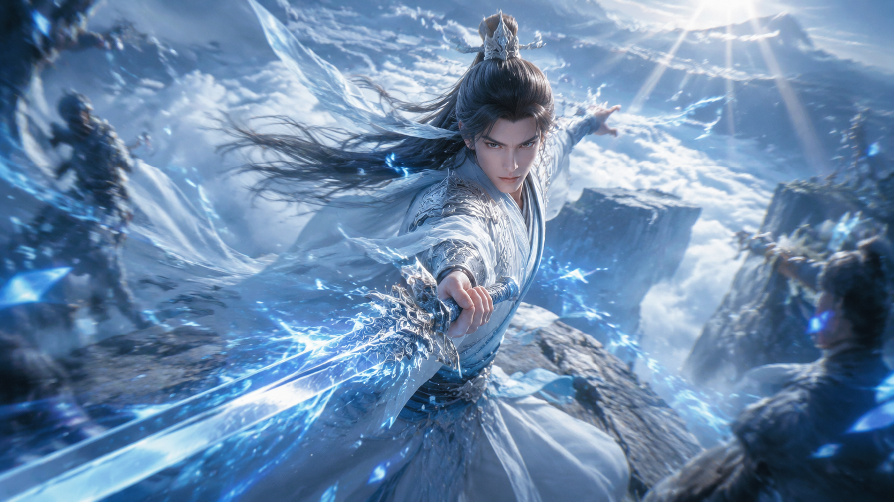

# 战斗动作 / Action Examples

## 剑修出招 Swordsman Slash (16:9)

### 中文提示词

```
国产3D动漫风格，电影级动作场面，UE5 Lumen 全局光照，
粒子特效，体积光，动态模糊，高速摄影冻结瞬间，
环境破坏，史诗感，仙侠战斗，白衣剑修挥剑出招全身动态图，
长发飞扬，衣袂猎猎作响，眼神锐利坚定，
右手持长剑剑身泛着冰蓝色剑气，左手结剑指，
剑气划破空气带出冰晶粒子和光轨，
悬崖边背景，身后万丈深渊和翻涌云海，35mm 广角 f2.8
比例 16:9
```

### English Prompt

```
Chinese 3D donghua anime style, cinematic action scene, 
UE5 Lumen global illumination, particle effects, volumetric light, 
motion blur, high-speed photography frozen moment, 
environment destruction, epic feel, xianxia battle, masterpiece, 
white robed swordsman mid slash attack, hair flowing dynamically, 
robes billowing, sharp determined gaze, 
right hand holding sword glowing ice blue sword qi, left hand forming sword seal, 
sword qi cutting through air with ice crystal particles and light trails, 
cliff edge background, bottomless abyss and rolling cloud sea behind, 
35mm wide angle f2.8
Ratio 16:9
```

### 参考样图



### 适用场景

- 海报主视觉
- 短视频开场镜头
- 战斗场面预热

---

## 法师施法 Mage Casting (16:9) - 待补

### 中文提示词

```
国产3D动漫风格，电影级动作场面，UE5 Lumen 全局光照，
粒子特效，体积光，动态模糊，高速摄影冻结瞬间，
环境破坏，史诗感，仙侠战斗，女法师施法全身动态图，
长袍飞扬，长发飞舞，眼神坚定，双手高举过头，
双掌间汇聚巨大的金色光球，光球周围环绕符文和粒子，
光球发出耀眼金光照亮周围，地面被光芒压出裂纹，
身后魔法阵展开，仰视构图，35mm 广角 f2.8
比例 16:9
```

### English Prompt

```
Chinese 3D donghua anime style, cinematic action scene, 
UE5 Lumen global illumination, particle effects, volumetric light, 
motion blur, high-speed photography frozen moment, 
environment destruction, epic feel, xianxia battle, masterpiece, 
female mage casting full body dynamic, robes billowing, long hair flying, 
determined gaze, both hands raised overhead, 
golden light sphere gathering between palms, runes and particles around light sphere, 
blinding golden light illuminating surroundings, ground cracking from light pressure, 
magic array expanding behind, low angle, 35mm wide angle f2.8
Ratio 16:9
```