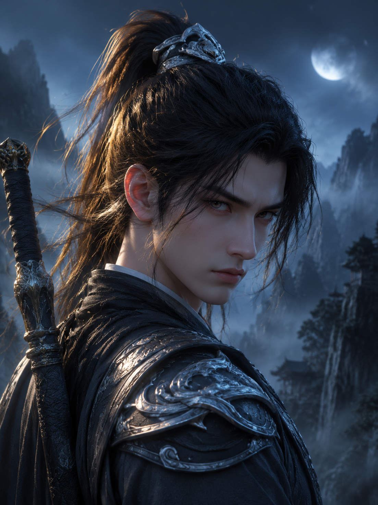
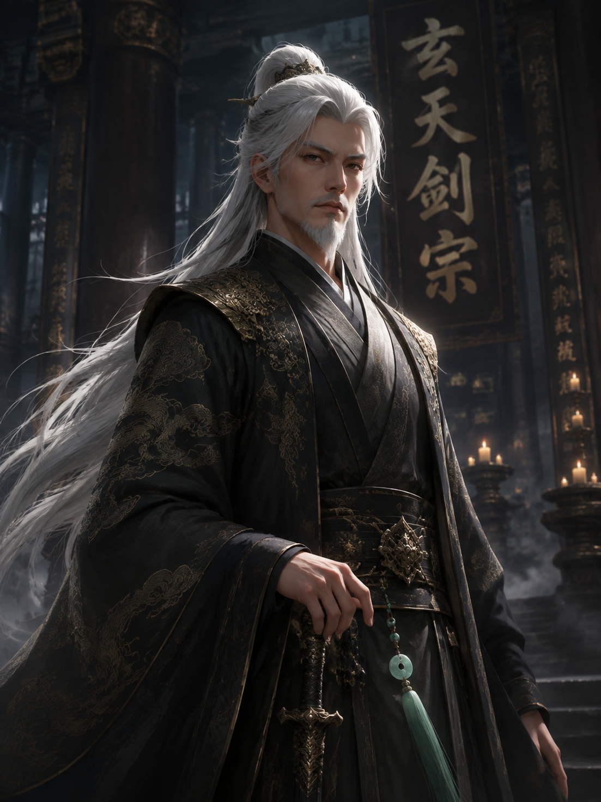
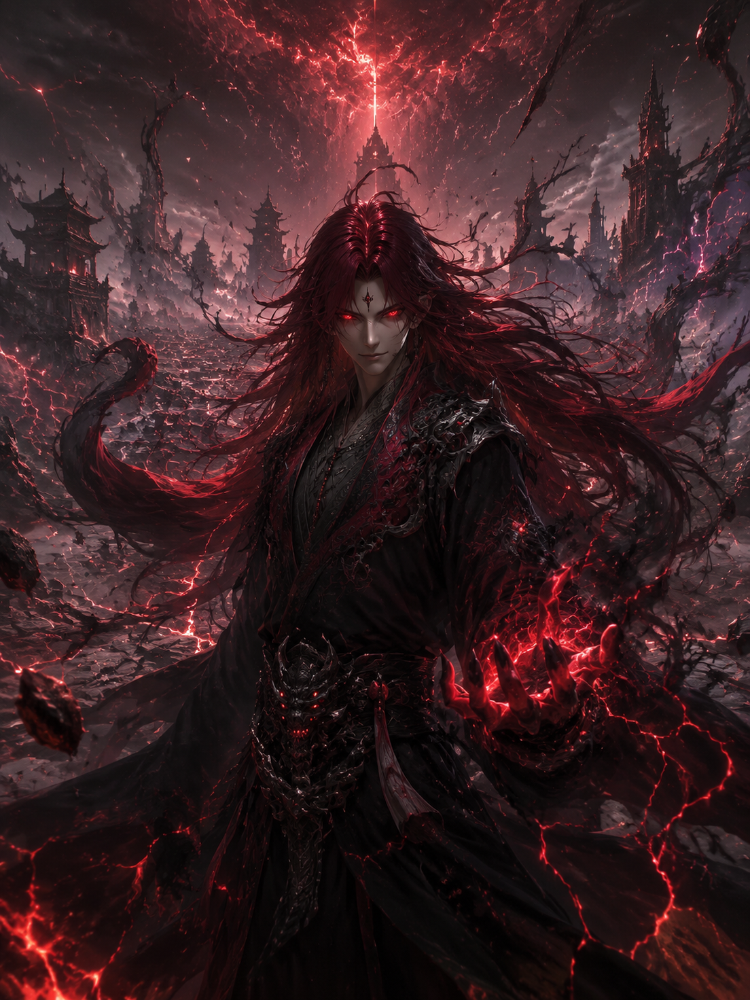

# 男性角色 / Character Male Examples

## 冷峻剑修 Swordsman (3:4)

### 中文提示词

```
国产3D动漫风格，电影级3D光影，写实人像，UE5 Nanite + Lumen 渲染，
PBR材质，皮肤毛孔清晰，发丝根根分明，东方美学，仙侠玄幻，
气势磅礴，史诗感，冷峻的青年剑修面部特写，眉宇冷峻，
黑色长发高束，鬓角碎发，脸部轮廓棱角分明，深色劲装，
银色肩甲纹路，侧逆光打在发丝上，金色轮廓光，
背景虚化月下山巅，薄雾弥漫，手部自然，手指数量正确
比例 3:4
```

### English Prompt

```
Chinese 3D donghua anime style, cinematic 3D lighting, realistic portrait, 
UE5 Nanite + Lumen render, PBR materials, visible skin pores, 
individual hair strands, oriental aesthetics, xianxia fantasy, 
epic atmosphere, masterpiece, cold young swordsman portrait, 
black hair tied high with loose strands, sharp jawline, 
dark warrior robes with silver shoulder armor, rim light from side 
casting golden edge light on hair strands, misty moonlit mountain 
peak background with shallow depth of field, anatomically correct hands
Ratio 3:4
```

### 参考样图



### 适用模型

| 模型 | 推荐度 | 备注 |
|------|--------|------|
| Seedream | ⭐⭐⭐⭐⭐ | 国漫首选 |
| gpt-image-2 | ⭐⭐⭐⭐ | 光影氛围优秀 |
| qwen-image-3.0 | ⭐⭐⭐⭐ | 性价比首选 |

---

## 霸气宗主 Sect Master (3:4)

### 中文提示词

```
国产3D动漫风格，电影级3D光影，写实人像，UE5 Nanite + Lumen 渲染，
PBR材质，皮肤毛孔清晰，发丝根根分明，东方美学，仙侠玄幻，
气势磅礴，史诗感，威严的中年男子半身像，目光深邃，
白色长发披肩，剑眉星目，下巴短须，面部岁月痕迹但不显老态，
身穿玄色宗主长袍，金色刺绣云纹，腰间玉佩，
右手轻抚长剑剑柄，左手负于身后，宗门大殿背景，
烛光摇曳，巨柱撑天，伦勃朗光，金属材质光泽
比例 3:4
```

### English Prompt

```
Chinese 3D donghua anime style, cinematic 3D lighting, realistic portrait, 
UE5 Nanite + Lumen render, PBR materials, visible skin pores, 
individual hair strands, oriental aesthetics, xianxia fantasy, 
epic atmosphere, masterpiece, dignified middle-aged sect master, 
flowing white hair, sharp eyebrows, short beard showing maturity, 
dark sect master robes with gold embroidered cloud patterns, jade pendant, 
right hand resting on sword hilt, left hand behind back, sect great hall 
background, candlelight, giant pillars, Rembrandt lighting, metallic sheen
Ratio 3:4
```

### 参考样图



---

## 魔尊重生 Demon Lord (3:4)

### 中文提示词

```
国产3D动漫风格，电影级3D光影，写实人像，UE5 Nanite + Lumen 渲染，
PBR材质，皮肤毛孔清晰，发丝根根分明，东方美学，
暗黑玄幻，毁灭美学，史诗感，黑袍男子全身像，释放魔气，
血红色长发狂舞，瞳孔血红色，面容邪魅，黑色魔纹长袍，
袍角被魔气托起悬浮，双手张开，周围环绕黑色魔气和红色闪电，
脚下崩裂大地，远处毁灭城市废墟，仰视构图，低位侧光
比例 3:4
```

### English Prompt

```
Chinese 3D donghua anime style, cinematic 3D lighting, realistic portrait, 
UE5 Nanite + Lumen render, PBR materials, visible skin pores, 
individual hair strands, oriental aesthetics, dark fantasy, 
destruction aesthetic, masterpiece, black-robed man full body, 
releasing demonic energy, blood red long hair wild, blood red pupils, 
sinister smirk, black demon pattern robes, robe hem floating with demonic energy, 
both hands spread, surrounded by black demonic energy and red lightning, 
cracked earth below, ruined city in distance, low angle, dramatic side lighting
Ratio 3:4
```

### 参考样图

