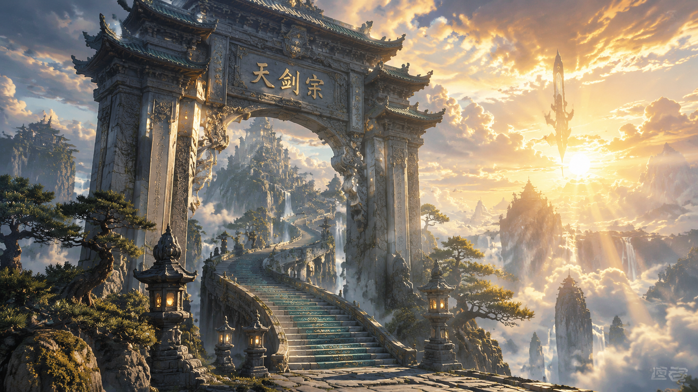
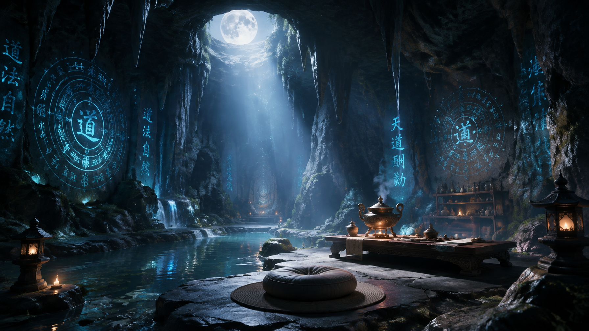
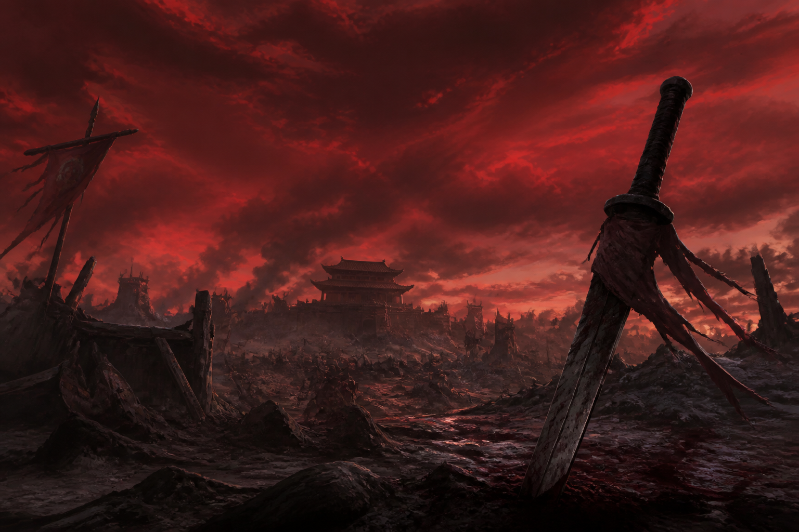

# 场景 / Scene Examples

## 仙门山门 Sect Mountain Gate (16:9)

### 中文提示词

```
国产3D动漫风格，电影级场景渲染，UE5 大气散射，体积云，
建筑材质有历史感，雾气飘渺，丁达尔效应，意境悠远，
东方美学，仙侠玄幻，气势恢宏，史诗感，仙侠宗门山门全景，
巨大石质山门矗立云海之上，门上刻有「天剑宗」三字，
石阶蜿蜒而上，两侧石灯和古松，云海翻涌，远处仙鹤翱翔，
瀑布从山巅倾泻，黄昏时分金色阳光穿透云层
比例 16:9
```

### English Prompt

```
Chinese 3D donghua anime style, cinematic environment render, 
UE5 atmospheric scattering, volumetric clouds, 
weathered architectural materials, drifting mist, god rays, 
deep atmosphere, oriental aesthetics, xianxia fantasy, epic scale, masterpiece, 
majestic celestial sect mountain gate, giant stone archway engraved Tian Jian Zong 
floating above cloud sea, jade stairs winding upward, ancient pines and stone lanterns, 
golden cranes soaring in distance, waterfall cascading from mountain peak, 
golden hour sunlight piercing through clouds with Tyndall effect
Ratio 16:9
```

### 参考样图



---

## 修炼洞府 Cultivation Cave (16:9)

### 中文提示词

```
国产3D动漫风格，电影级场景渲染，UE5 大气散射，体积云，
建筑材质有历史感，雾气飘渺，丁达尔效应，意境悠远，
东方美学，仙侠玄幻，气势恢宏，史诗感，修士修炼洞府内景，
中央蒲团和矮案，案上古籍和丹炉，洞壁天然钟乳石，
滴水形成小潭，墙上刻古朴修炼法阵泛着微弱蓝光，
顶部天窗月光倾泻而下，照亮漂浮的灵气粒子，
动态体积光，水面反射，材质细节
比例 16:9
```

### English Prompt

```
Chinese 3D donghua anime style, cinematic environment render, 
UE5 atmospheric scattering, volumetric clouds, 
weathered architectural materials, drifting mist, god rays, 
deep atmosphere, oriental aesthetics, xianxia fantasy, epic scale, masterpiece, 
mysterious cultivation cave interior, meditation cushion and ancient desk, 
mystical alchemy furnace, natural stalactite walls dripping water into small pool, 
glowing blue cultivation formation carved on walls, 
skylight moonlight streaming down illuminating floating spiritual particles, 
dynamic volumetric lighting, water reflections
Ratio 16:9
```

### 参考样图



---

## 古战场遗迹 Ancient Battlefield (16:9)

### 中文提示词

```
国产3D动漫风格，电影级场景渲染，UE5 大气散射，体积云，
建筑材质有历史感，雾气飘渺，意境悠远，
东方美学，暗黑玄幻，沧桑史诗，史诗感，
远古战场遗迹全景，巨大断剑插在焦土中，剑身锈迹斑斑
但仍有灵光闪烁，四周破碎盔甲和武器残骸，长满荒草，
天空血红色黄昏，乌鸦盘旋，远处倒塌的城墙，
地面战斗留下的沟壑和焦痕，体积雾，粒子灰尘，材质风化
比例 16:9
```

### English Prompt

```
Chinese 3D donghua anime style, cinematic environment render, 
UE5 atmospheric scattering, volumetric clouds, 
weathered architectural materials, drifting mist, 
deep atmosphere, oriental aesthetics, dark fantasy, epic desolate, masterpiece, 
ancient battlefield ruins panorama, massive broken sword thrust into scorched earth, 
blade rusted but still glowing with spiritual light, scattered broken armor and weapons 
overgrown with grass, blood red dusk sky with circling crows, 
collapsed city walls in distance, trenches and burn marks on ground, 
volumetric fog, particle dust, weathered materials
Ratio 16:9
```

### 参考样图

