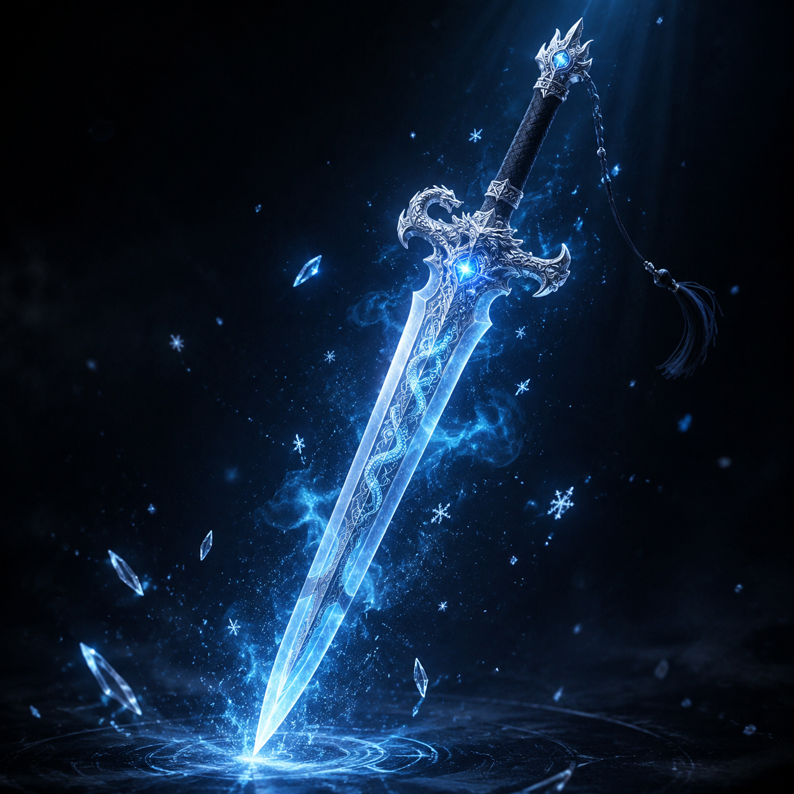

# 武器法宝 / Weapon & Artifact Examples

## 飞剑 / Flying Sword (1:1)

### 中文提示词

```
国产3D动漫风格，UE5 渲染，PBR材质细节，金属反射正确，
宝石发光质感，灵气粒子环绕，光效自然，
暗色调突出主体，电影级质感，仙侠飞剑剑身修长，
泛着冰蓝色灵光，剑格有龙纹雕刻，剑柄缠绕黑色丝带，
剑身周围环绕剑气和冰晶粒子，悬空漂浮微微颤动，
蓄势待发，背景虚化暗色调，突出剑的质感，
金属 PBR，冰属性发光材质
比例 1:1
```

### English Prompt

```
Chinese 3D donghua anime style, UE5 render, detailed PBR materials, 
correct metal reflections, glowing gemstone textures, 
spiritual energy particles, natural light effects, 
dark tones highlight subject, cinematic quality, masterpiece, 
mystical flying sword artifact, slender blade glowing ice blue spiritual light, 
dragon engravings on guard, black silk wrapped handle, 
surrounded by sword qi particles and ice crystals, 
floating in air with slight tremble, ready to strike, 
dark background with rim light, metallic PBR, ice attribute glow
Ratio 1:1
```

### 参考样图



### 适用场景

- 角色设定中的武器展示
- 海报主视觉的武器特写
- 短视频中武器旋转展示

---

## 魔刀 / Demon Blade (1:1) - 待补

### 中文提示词

```
国产3D动漫风格，UE5 渲染，PBR材质细节，金属反射正确，
宝石发光质感，灵气粒子环绕，光效自然，
暗色调突出主体，电影级质感，魔道邪刀刀身漆黑如墨，
血红色纹路脉动，刀刃处黑色魔气缭绕，
散发不祥气息，刀柄白骨造型镶嵌红色宝石，
放置在石台上，周围地面龟裂，魔气蔓延，
黑曜石质感，魔气体积雾，血色发光
比例 1:1
```

### English Prompt

```
Chinese 3D donghua anime style, UE5 render, detailed PBR materials, 
correct metal reflections, glowing gemstone textures, 
spiritual energy particles, natural light effects, 
dark tones highlight subject, cinematic quality, masterpiece, 
demonic evil blade, body black as ink, blood red veins pulsing, 
black demonic energy swirling around edge, ominous aura, 
bone-shaped handle inlaid with red gemstone, 
placed on stone platform, ground cracking around, demonic energy spreading, 
obsidian texture, demonic volumetric fog, blood-colored glow
Ratio 1:1
```

---

## 灵珠 / Spirit Pearl (1:1) - 待补

### 中文提示词

```
国产3D动漫风格，UE5 渲染，PBR材质细节，金属反射正确，
宝石发光质感，灵气粒子环绕，光效自然，
暗色调突出主体，电影级质感，仙侠灵珠珠体通透，
内部有星光流转，珠身周围环绕柔和的灵光和灵气粒子，
悬浮在半空微微旋转，散发温暖光芒，
背景虚化暗色调，突出珠的质感，琉璃质感，发光材质
比例 1:1
```

### English Prompt

```
Chinese 3D donghua anime style, UE5 render, detailed PBR materials, 
correct metal reflections, glowing gemstone textures, 
spiritual energy particles, natural light effects, 
dark tones highlight subject, cinematic quality, masterpiece, 
xianxia spirit pearl, transparent body with starlight flowing inside, 
soft spiritual light and energy particles surrounding, 
floating mid-air rotating gently, emitting warm glow, 
dark background with rim light, glass texture, luminous material
Ratio 1:1
```