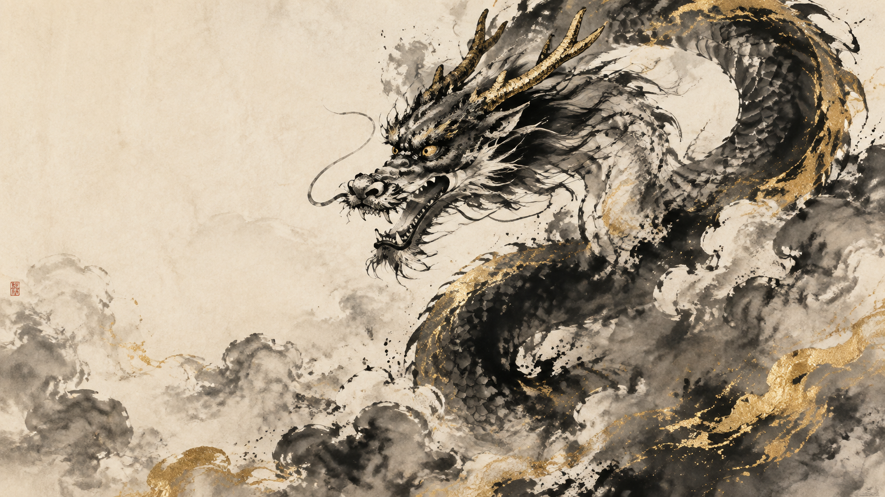

# 瑞兽 / Creature Examples

## 神龙 Dragon (16:9)

### 中文提示词

```
中国传统瑞兽水墨画，手绘毛笔笔触，宣纸纹理，
泼墨写意，留白构图，
传统国画美学，气势磅礴，史诗感，
浓墨重彩，笔触强烈，对比鲜明，气势磅礴，
水墨为主，金色点缀（龙鳞、印章、金线），
神龙腾飞云海，龙首高昂，龙须飘逸，
龙身以泼墨笔法绘制，金色龙鳞点缀，
云海以淡墨渲染，留白天空
比例 16:9
```

### English Prompt

```
traditional Chinese mythical creature ink painting, hand-painted brushwork, 
rice paper texture, splash ink freehand, 
vast negative space, 
traditional Chinese painting, epic grandeur,
bold heavy ink, strong brushwork, high contrast, epic grandeur,
monochrome base with gold accents (dragon scales, seals, gold thread),
divine dragon soaring through cloud sea, head held high, flowing whiskers,
dragon body painted with bold splash technique, golden scales accents,
cloud sea with light wash rendering, vast empty sky
Ratio 16:9
```

### 参考样图



---

## 凤凰 Phoenix (3:4) - 待补

### 中文提示词

```
中国传统瑞兽水墨画，手绘毛笔笔触，宣纸纹理，
泼墨写意，留白构图，
传统国画美学，气势磅礴，史诗感，
浓墨重彩，笔触强烈，对比鲜明，气势磅礴，
水墨为主，金色点缀（龙鳞、印章、金线），
凤凰展翅飞翔，长尾飘逸，羽翼华丽，
金红羽毛点缀，背景云海以淡墨渲染，
留白构图
比例 3:4
```

### English Prompt

```
traditional Chinese mythical creature ink painting, hand-painted brushwork, 
rice paper texture, splash ink freehand, 
vast negative space, 
traditional Chinese painting, epic grandeur,
bold heavy ink, strong brushwork, high contrast, epic grandeur,
monochrome base with gold accents (dragon scales, seals, gold thread),
phoenix spreading wings in flight, long flowing tail, gorgeous wings,
gold and red feather accents, background cloud sea with light wash,
negative space composition
Ratio 3:4
```