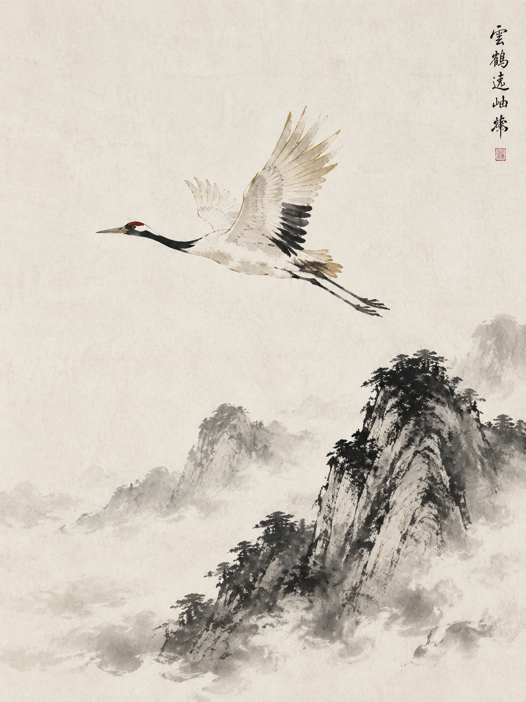
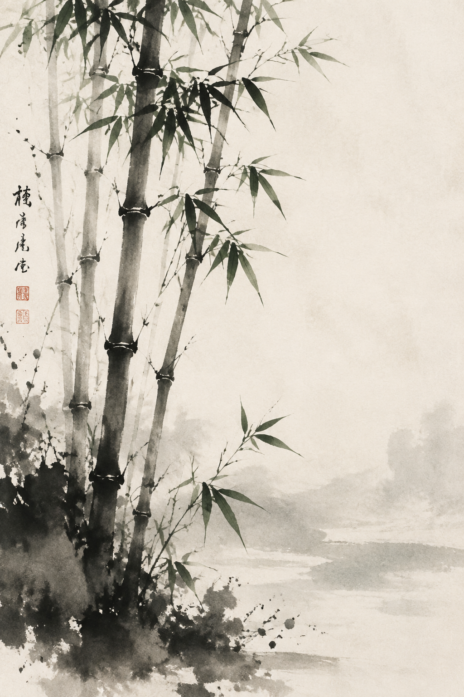

# 花鸟 / Nature Examples

## 仙鹤 Crane (3:4)

### 中文提示词

```
中国传统花鸟画，手绘毛笔笔触，宣纸纹理，
工笔写意结合，留白构图，
传统国画美学，诗意意境，
中墨平衡，主体清晰，意境与细节兼具，
纯水墨，黑白为主，传统，
仙鹤飞翔于云端，长颈舒展，羽翅展开，
羽毛以侧锋笔法处理，浓墨点睛，
天空大量留白，仅有淡墨云气
比例 3:4
```

### English Prompt

```
traditional Chinese flower-and-bird painting, hand-painted brushwork, 
rice paper texture, mixed gongbi and freehand, 
vast negative space, 
traditional Chinese painting, poetic mood,
medium ink density, clear subject, balanced atmosphere and detail,
pure monochrome, black ink on white paper, traditional,
crane flying through clouds, long neck extended, wings spread,
feathers with broad side brush technique, bold ink for eye,
vast empty sky with only light wash clouds
Ratio 3:4
```

### 参考样图



---

## 竹影 Bamboo (3:4)

### 中文提示词

```
中国传统花鸟画，手绘毛笔笔触，宣纸纹理，
工笔写意结合，留白构图，
传统国画美学，诗意意境，
中墨平衡，主体清晰，意境与细节兼具，
水墨为主，朱砂点缀（梅花、唇色、丝带、印章），
竹林疏朗，竹竿笔直，竹叶以侧锋绘成，
风过竹叶摇曳，地面留白，
远处朱砂点点（红梅或印章点缀）
比例 3:4
```

### English Prompt

```
traditional Chinese flower-and-bird painting, hand-painted brushwork, 
rice paper texture, mixed gongbi and freehand, 
vast negative space, 
traditional Chinese painting, poetic mood,
medium ink density, clear subject, balanced atmosphere and detail,
monochrome base with vermillion red accents (plum blossoms, lips, ribbons, stamp),
sparse bamboo grove, straight bamboo trunks, leaves painted with side brush,
wind blowing leaves, empty ground,
distant vermillion dots (red plum or seal accents)
Ratio 3:4
```

### 参考样图

