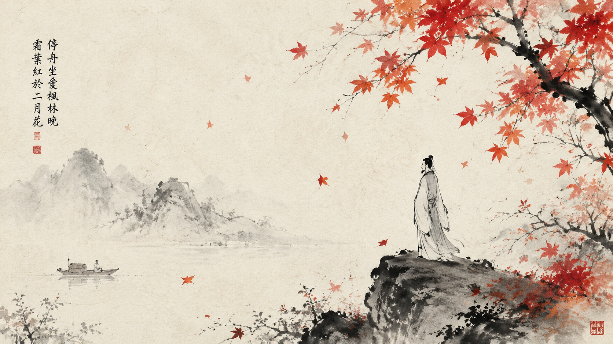
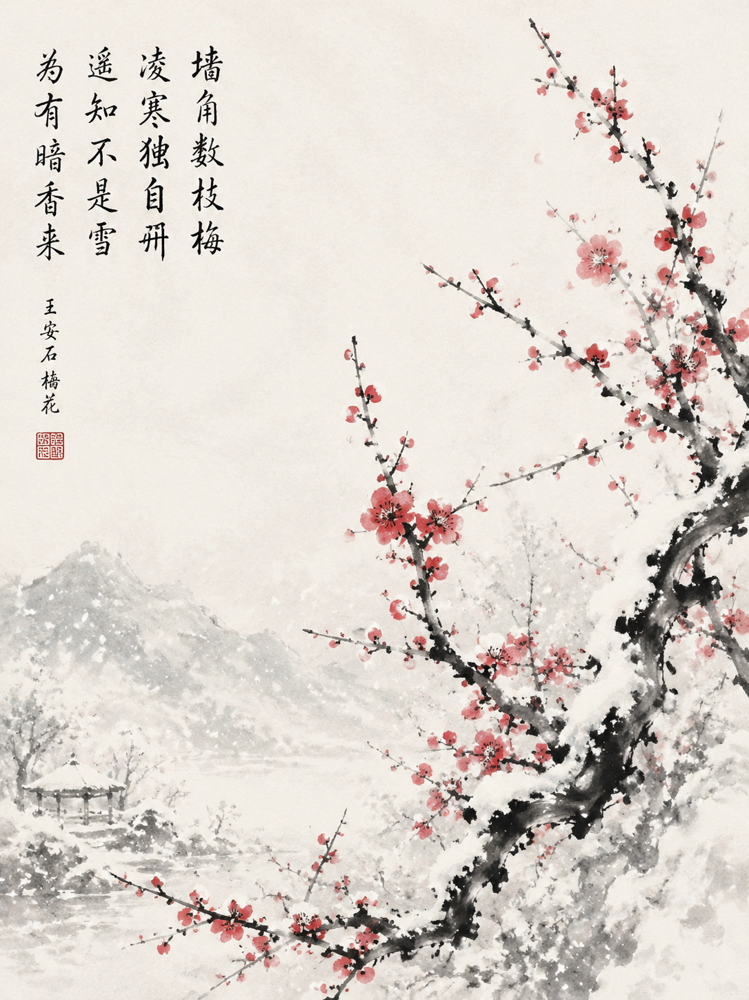

# 诗意场景 / Poetry Examples

## 秋日枫林 Autumn Maple (16:9)

### 中文提示词

```
中国传统诗意水墨画，手绘毛笔笔触，宣纸纹理，
墨色淡雅，留白构图，
传统国画美学，诗意空灵，禅意，
淡墨为主，大量留白，仅极轻笔触，意境深远，
水墨为主，朱砂点缀（梅花、唇色、丝带、印章），
秋日枫林，落叶飘零，疏枝斜出，
朱砂点点红叶，淡墨枝干，
留白天空，意境寂寥
比例 16:9
```

### English Prompt

```
traditional Chinese poetic ink painting, hand-painted brushwork, 
rice paper texture, light elegant ink, 
vast negative space, 
traditional Chinese painting, poetic ethereal mood, Zen,
light ink dominant, vast empty paper, minimal brushwork, deep atmosphere,
monochrome base with vermillion red accents (plum blossoms, lips, ribbons, stamp),
autumn maple grove, drifting leaves falling, sparse diagonal branches,
vermillion dots for red leaves, light ink for branches,
vast empty sky, melancholic contemplative atmosphere
Ratio 16:9
```

### 参考样图



---

## 雪中寒梅 Plum in Snow (3:4)

### 中文提示词

```
中国传统诗意水墨画，手绘毛笔笔触，宣纸纹理，
墨色淡雅，留白构图，
传统国画美学，诗意空灵，禅意，
淡墨为主，大量留白，仅极轻笔触，意境深远，
水墨为主，朱砂点缀（梅花、唇色、丝带、印章），
雪中寒梅，疏枝横斜，朱砂点点红梅，
背景以留白为雪，枝干以飞白笔法处理，
墨梅点点，意境高洁
比例 3:4
```

### English Prompt

```
traditional Chinese poetic ink painting, hand-painted brushwork, 
rice paper texture, light elegant ink, 
vast negative space, 
traditional Chinese painting, poetic ethereal mood, Zen,
light ink dominant, vast empty paper, minimal brushwork, deep atmosphere,
monochrome base with vermillion red accents (plum blossoms, lips, ribbons, stamp),
plum blossoms in snow, sparse diagonal branches,
vermillion dots for plum petals, light ink for branches,
background paper preserved as snow, branches with flying white texture,
subtle ink dots, noble pure mood
Ratio 3:4
```

### 参考样图

