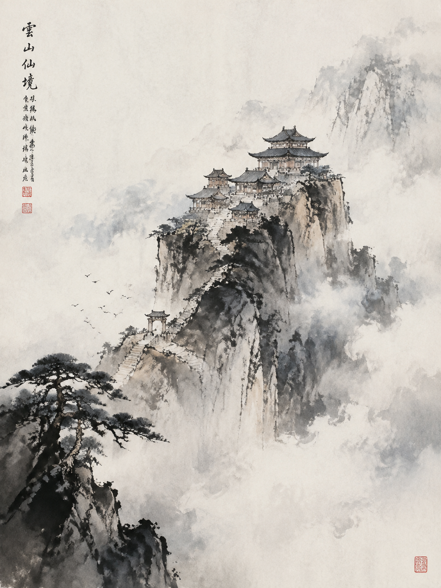
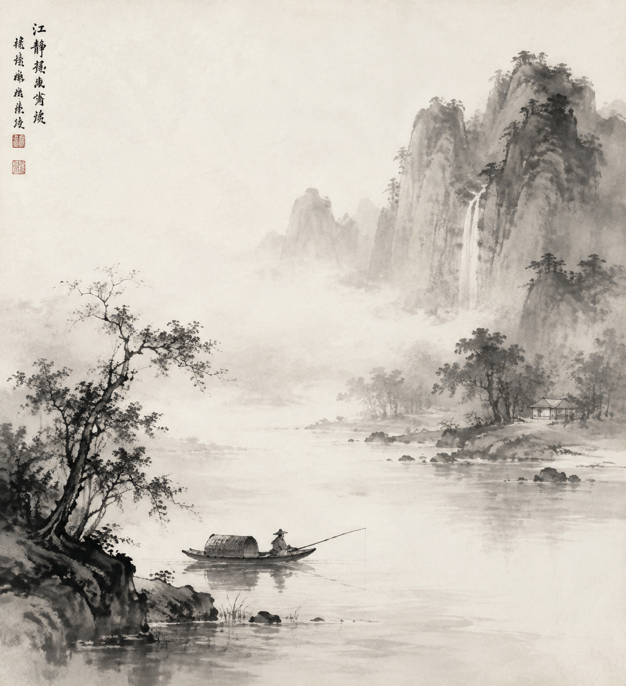
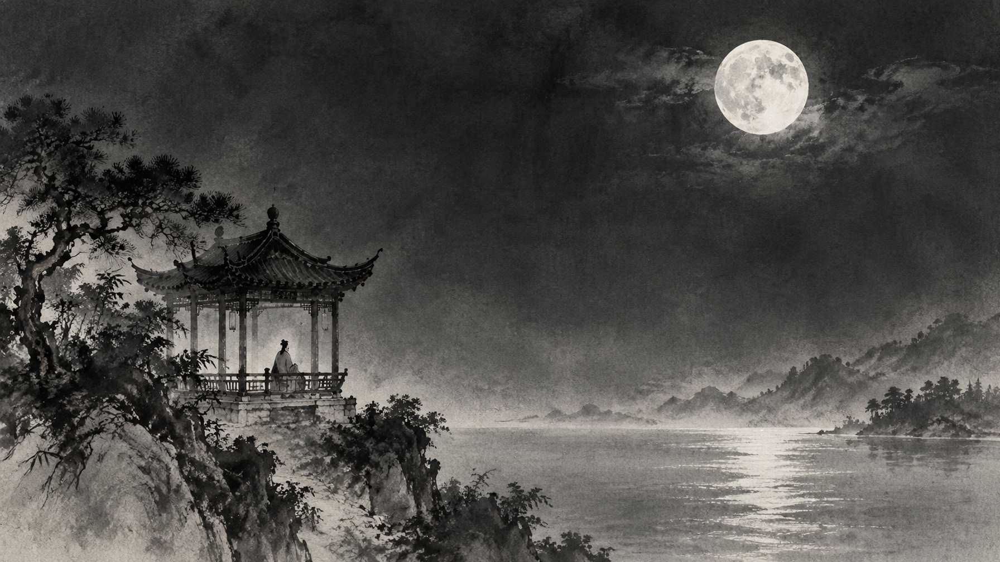

# 场景 / Scene Examples

## 远山云雾 Mountain in Mist (16:9)

### 中文提示词

```
中国传统水墨山水，手绘毛笔笔触，宣纸纹理，
墨分五色，皴法纹理，留白意境，
三远法构图，诗意空灵，史诗感，
淡墨为主，大量留白，仅极轻笔触，意境深远，
纯水墨，黑白为主，传统，
远山层叠，云雾缭绕，山脚溪流，
近处岩石树木，远山朦胧几乎隐于纸面，
皴法绘山石纹理，留白天空
比例 16:9
```

### English Prompt

```
traditional Chinese ink landscape painting, hand-painted brushwork, 
rice paper texture, five-tone ink variation, 
cun texture strokes, vast negative space, 
three-distance composition, poetic ethereal mood, epic,
light ink dominant, vast empty paper, minimal brushwork, deep atmosphere,
pure monochrome, black ink on white paper, traditional,
layered distant mountains, mist swirling around peaks, mountain stream below,
foreground trees and rocks, distant peaks fading into paper,
cun texture strokes for rocks and mountains, empty sky
Ratio 16:9
```

### 参考样图



---

## 江江暮色 Misty River (16:9)

### 中文提示词

```
中国传统水墨山水，手绘毛笔笔触，宣纸纹理，
墨分五色，皴法纹理，留白意境，
三远法构图，诗意空灵，史诗感，
淡墨为主，大量留白，仅极轻笔触，意境深远，
纯水墨，黑白为主，传统，
江面辽阔，孤舟泛于水面，远处山影朦胧，
水波以中锋线条勾勒，留白天空，
岸边疏柳几枝，烟雨朦胧
比例 16:9
```

### English Prompt

```
traditional Chinese ink landscape painting, hand-painted brushwork, 
rice paper texture, five-tone ink variation, 
cun texture strokes, vast negative space, 
three-distance composition, poetic ethereal mood, epic,
light ink dominant, vast empty paper, minimal brushwork, deep atmosphere,
pure monochrome, black ink on white paper, traditional,
vast river surface, lone boat floating, distant mountain shadows hazy,
water surface with central brush line patterns, vast empty sky,
sparse willow trees on bank, misty rain atmosphere
Ratio 16:9
```

### 参考样图



---

## 月下楼阁 Moonlit Pavilion (16:9)

### 中文提示词

```
中国传统水墨山水，手绘毛笔笔触，宣纸纹理，
墨分五色，皴法纹理，留白意境，
三远法构图，诗意空灵，史诗感，
中墨平衡，主体清晰，意境与细节兼具，
水墨为主，金色点缀（龙鳞、印章、金线），
月下楼阁，银月高悬，
楼阁以中墨勾勒，屋顶飞檐，金色月光点缀，
松树枝干以飞白笔法处理，
地面留白如水，留白天空
比例 16:9
```

### English Prompt

```
traditional Chinese ink landscape painting, hand-painted brushwork, 
rice paper texture, five-tone ink variation, 
cun texture strokes, vast negative space, 
three-distance composition, poetic ethereal mood, epic,
medium ink density, clear subject, balanced atmosphere and detail,
monochrome base with gold accents (dragon scales, seals, gold thread),
ancient pavilion under full moon, silver moon overhead,
pavilion outlined in medium ink, flying eaves roof, golden moonlight accents,
pine tree trunks with flying white texture strokes,
ground as empty paper water, vast negative space sky
Ratio 16:9
```

### 参考样图

